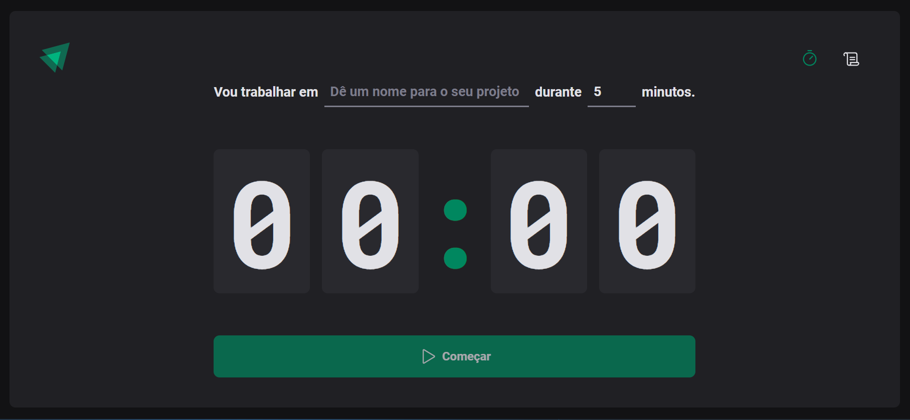

<h1 align="center">
  Iginite Timer ⏱️
</h1>

<p align="center">
  <a href="#-sobre-o-projeto">Projeto</a>&nbsp;&nbsp;&nbsp;|&nbsp;&nbsp;&nbsp;
  <a href="#-conceitos-utilizados-no-desenvolvimento">Conceitos</a>&nbsp;&nbsp;&nbsp;|&nbsp;&nbsp;&nbsp;
  <a href="#-tecnologias-utilizadas">Tecnologias</a>&nbsp;&nbsp;&nbsp;|&nbsp;&nbsp;&nbsp;
  <a href="#-como-executar-o-projeto">Executar o projeto</a>&nbsp;&nbsp;&nbsp;
</p>

# 🚧 Sobre o projeto

Preview: ignite-timer-joaosam.vercel.app/

Aplicação Ignite Timer desenvolvida no módulo: Criando SPAs com ReactJS, Typescript. Utilizando libs como react-hook-form e YUP para validação do formulário.
A ideia desse projeto foi iplementar a técnica de Pomodoro.

## 🛠️ Funcionalidades

- Play/Stop na contagem regressiva de seus trabalhos
- Toda ação fica salva na guia página de histórico
- Salvando o histórico no Localstorage para não perder nada

# 📚 Conceitos Utilizados no Desenvolvimento

- Hooks do react como UseState, UseEffect e UseContext
- Tipagem no código, mitigando ao máximo erros no código

## 🎨 Layout



# 🚀 Tecnologias utilizadas

- TypeScript
- ReactJS
- Styled Components

# 💻 Como executar o projeto

Pré-requisitos: npm / yarn

```bash
# Clonar repositório
git clone https://github.com/Joaosam/IgniteTimer.git

# Navegar até a pasta
cd IgniteTimer

# Instalar dependências
npm install

# Executar o projeto
npm run dev
```

<br />

---

Feito com ♥ by Joaosam
